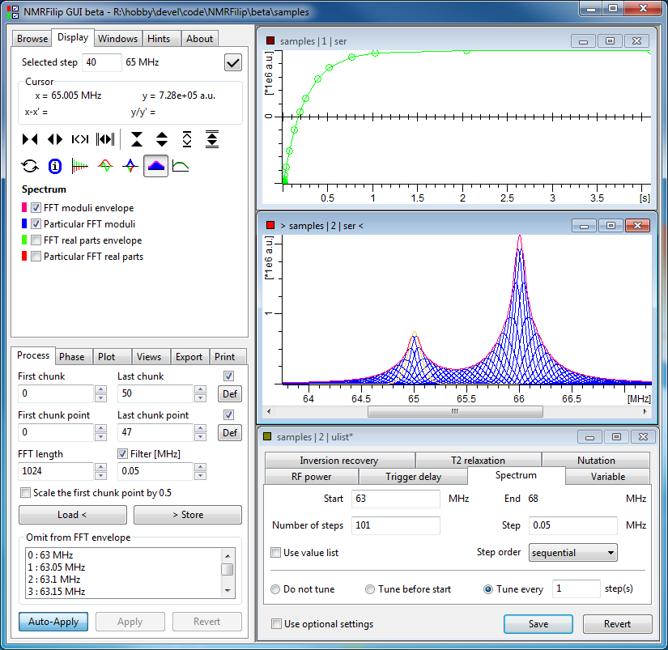

# NMRFilip

NMRFilip is the NMR data processing software consisting of three program parts:
- NMRFilip GUI - graphical user interface
- NMRFilip CLI - command line interface
- NMRFilip LIB - core library

NMRFilip is primarily intended for processing of data from broadband solid-state NMR experiments. This may include for instance composition of final spectrum from a number of measurement steps at different excitation frequencies, routine evaluation of signal intensity in dependence on pulse sequence parameters, or improving signal-to-noise ratio by averaging acquired echo train from CPMG sequence. (Currently, only the acquisition data format used by Bruker NMR spectrometers is supported.) 

Since the beginning, the development of the NMRFilip software has been a private hobby activity. Therefore, the number of implemented features is determined by the amount of spare time dedicated to the development. 

### Platforms

The software is intended for Windows and unix-like systems, such as Linux. 

### License
NMRFilip is licensed under the [GNU General Public License version 2](https://github.com/RichardReznicek/NMRFilip/blob/master/LICENSE) or (at your option) any later version. Copyright and licensing information is provided mainly in the files "COPYRIGHT_INFO.txt", "COPYRIGHT" and "COPYING" in the corresponding directories and at several other places in addition.
